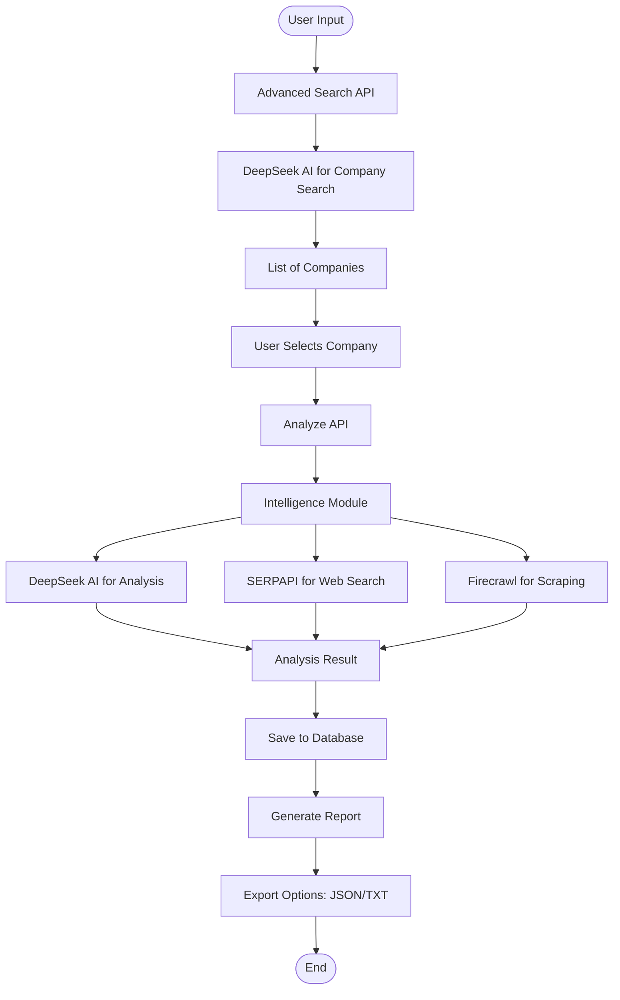

[data_flow.md](https://github.com/user-attachments/files/26877584/data_flow.md)

# Data Flow Diagram

This diagram illustrates the data flow within the IntelliRadar application, from user input to report generation.
