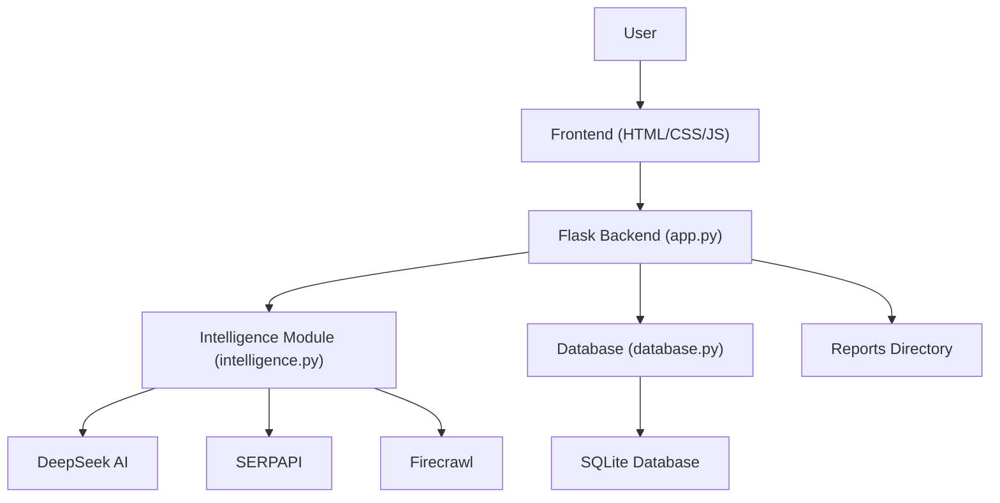

[architecture.md](https://github.com/user-attachments/files/26877615/architecture.md)
# Project Architecture Diagram

This diagram shows the high-level architecture of the IntelliRadar application, including user interaction, frontend, backend, AI integrations, and data storage.
